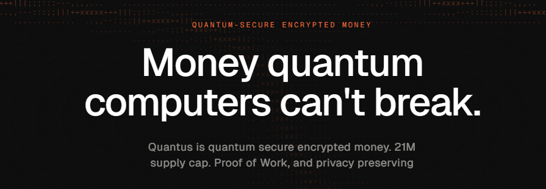
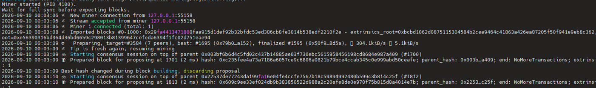
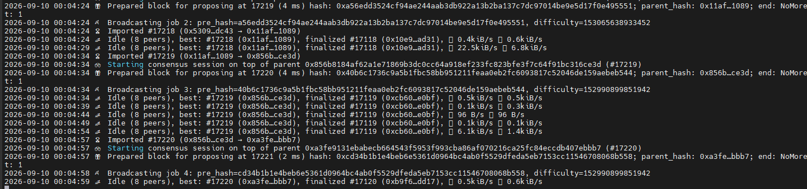
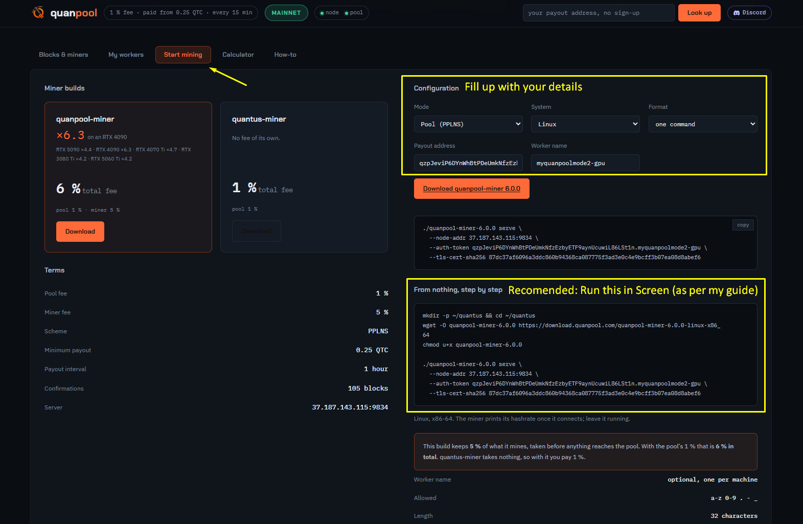

# Quantus Node

A step by step guide on How to Run a Quantus Node and Mine `QTC` on **Mainnet**.

Quantus is a post-quantum Proof-of-Work chain (QPoW). Mining uses Poseidon2 hashing. Rewards go to a **wormhole address**, not a normal wallet address.

This is a community walkthrough by [sinascorpion](https://github.com/sinascorpion) based on official docs. If something conflicts, follow official:

* Mining guide: https://docs.quantus.com/guides/mining/
* Node releases: https://github.com/Quantus-Network/chain/releases
* Miner releases: https://github.com/Quantus-Network/quantus-miner/releases
* Org: https://github.com/Quantus-Network

---

### Versions used in this guide (check before you install)

| Component | Version | Source |
| --- | --- | --- |
| Node | `v1.0.1` | [chain releases](https://github.com/Quantus-Network/chain/releases/latest) |
| Miner | `v4.1.0` | [miner releases](https://github.com/Quantus-Network/quantus-miner/releases/latest) |
| Chain | `mainnet` | `--chain mainnet` |
| Miner protocol | `quantus-miner/2` | auth + TLS pin required |

Always re-check those two release pages. They are published independently.

---

## Hardware Requirements

From official `MINING.md`:

<table>
  <tr>
    <th></th>
    <th>Minimum</th>
    <th>Recommended</th>
  </tr>
  <tr>
    <td>CPU</td>
    <td><code>2+ cores</code></td>
    <td><code>4+ cores</code></td>
  </tr>
  <tr>
    <td>RAM</td>
    <td><code>4 GB</code></td>
    <td><code>8 GB+</code></td>
  </tr>
  <tr>
    <td>Disk</td>
    <td><code>100 GB</code></td>
    <td><code>500 GB+ SSD</code></td>
  </tr>
  <tr>
    <td>Network</td>
    <td><code>3+ Mbps</code> (below this, sync will likely fail)</td>
    <td><code>10+ Mbps</code></td>
  </tr>
  <tr>
    <td>OS</td>
    <td colspan="2">Linux (Ubuntu 20.04+), macOS (10.15+), or Windows 10/11 (WSL2 / native MSVC)</td>
  </tr>
</table>

* GPU mining is recommended (Metal / Vulkan / DirectX, or NVIDIA CUDA with `--cuda-gpu`).
* Built-in node mining is limited (~15 MH/s per CPU thread). Use the **external miner**.
* Target block time is ~12 seconds. Native token is `QTC` (21,000,000 max, 12 decimals). Addresses start with `qz...` (SS58 prefix 189).

**Windows Users:** install Ubuntu on Windows with this [guide](https://github.com/sinascorpion/Install-Linux-on-Windows), then continue.

**VPS Users:** a Linux x86_64 VPS works for the node. [Aeza](https://aeza.net/?ref=419297). See [Linux Node Guide](https://github.com/sinascorpion/Linux_Node_Guide/).

**GPU Users:** mining needs a GPU box. Rent NVIDIA GPUs on [Vast](https://cloud.vast.ai/?ref_id=130567). You can also run the node on a VPS and the miner on a local GPU over VPN.

---

## Pick a path first

Do **not** start Method 1 if you only wanted to mine without running a node.

| You want | Do this |
| --- | --- |
| Mine with a GPU, no node, less ops | **[Method 3: Quanpool](#method-3-quanpool-no-local-node)** — miner only. Wallet + pool. |
| Your own node + miner (0% pool fee) | Wallet (step 2) → firewall (step 3) → **Method 1**. Method 2 if you want full control. |

Quanpool is the comfortable path for most GPU miners. Method 1/2 are for people who want to **be** a node.

**Quick tip:** rent a GPU on [Vast](https://cloud.vast.ai/?ref_id=130567) → wallet `qz...` → [Method 3: Quanpool](#method-3-quanpool-no-local-node) on **PPLNS**. That is the fastest way to start hashing. Skip Method 1/2 unless you want your own node.

---

## How mining works (simple)

1. You run `quantus-node` as a validator on `mainnet`.
2. The node syncs the chain and opens a miner QUIC server on port `9833`.
3. You run `quantus-miner` in a second process. It connects to `127.0.0.1:9833`, authenticates with a token, pins the node's TLS cert, and searches for nonces.
4. Valid work is submitted back to the node. Rewards land on your **wormhole address**.
5. If you used the **same 24-word phrase** as the Quantus wallet app, rewards show up in the app. There is **no separate claim step**.

Skip all of that and mine on **Quanpool** instead (Method 3): miner only, pool pays your `qz...` address. You pay their fee and trust their accounting.

### Wormhole values you must save

When you run `key quantus --scheme wormhole`, you get three things:

| Value | What it is | What to do |
| --- | --- | --- |
| **Address** | Wormhole address (rewards destination) | Note it, check explorer later |
| **Inner Hash** | 32-byte preimage | Pass to the node as `--rewards-inner-hash` |
| **Secret phrase** | 24 words that prove ownership | Backup offline. Recovers everything |

The node derives the wormhole address from `inner_hash` and logs it on startup.

**The 24-word phrase is the most important backup.** Do not share it. Do not paste it into a command that lands in shell history. The `--words` flow prompts silently.

---

## 1. Install Dependencies

```bash
sudo apt-get update && sudo apt-get upgrade -y
```

```bash
sudo apt install curl wget tar unzip jq screen ufw ca-certificates -y
```

`screen` keeps node/miner alive after you close SSH. Install it even if you skip straight to Quanpool:

```bash
sudo apt install screen -y
```

---

## 2. Quantus Wallet

Download the official wallet and create / restore your 24-word phrase:

* Wallet links: https://linktr.ee/quantusnetwork
* Wallet page: https://www.quantus.com/wallet/

Use this **same phrase** when generating the wormhole inner hash, so mining rewards appear in the app.

---

## 3. Firewall

Only P2P should be public.

```bash
ufw allow 22
ufw allow ssh
ufw allow 30333/tcp
ufw enable
ufw status
```

---

# Method 1: Official setup script (easiest own-node path)

macOS, Linux, or WSL2. This is the official guided installer.

**What this actually runs**

| Piece | This method? |
| --- | --- |
| Quantus **wallet** | Separate — do [step 2](#2-quantus-wallet) first |
| `quantus-node` | **Yes** — your own mainnet node |
| `quantus-miner` | **Yes** — solo against **your** node (`127.0.0.1:9833`) |
| Quanpool | **No** |

You are installing **node + miner** and mining solo on your machine. 0% pool fee. You must stay synced.

If you only wanted to point a miner at a pool and skip the node, **stop here** and go to [Method 3: Quanpool](#method-3-quanpool-no-local-node).

It generates wormhole inner hash + node identity, writes `~/quantus-mining/mining.conf` (`CHAIN=mainnet`), and downloads `quantus-node` + `quantus-miner` into `~/quantus-mining/bin/`.

### Setup commands

```bash
curl -fsSL https://docs.quantus.com/scripts/quantus-mining.sh -o quantus-mining.sh
chmod +x quantus-mining.sh
./quantus-mining.sh setup
```

### Run commands

```bash
# run both node + miner in background
# then watch logs with tail command (no `screen` required)
./quantus-mining.sh start -d

# one terminal: node in foreground, miner in background (need to run in screen or it dies when you close terminal/ssh)
./quantus-mining.sh start

# or two terminals (need to run in screen or they die when you close terminal/ssh)
./quantus-mining.sh start-node
# wait until miner server is listening, then:
./quantus-mining.sh start-miner

# stop (any terminal)
./quantus-mining.sh stop
```

Node log:

```bash
tail -f -n 300 ~/quantus-mining/logs/node.log
```

Miner log:

```bash
tail -f ~/quantus-mining/logs/miner.log
```

See current values:

```bash
./quantus-mining.sh config show
```

**No need of screen if you run with `-d`, or if you still want screen** (watch the node live):

```bash
sudo apt install screen -y
./quantus-mining.sh stop          # don't nest a second start inside screen
screen -S quantus
./quantus-mining.sh start
# detach: Ctrl + A, then D
# come back: screen -r quantus
```

### Wait for sync, then confirm mining

1. Wait until the **node is fully synced**. Blocks mined before tip are orphans and earn nothing.
2. Miner log: `tail -f ~/quantus-mining/logs/miner.log`. GPU: `nvidia-smi`.
3. Find your node on https://telemetry.quantus.cat/ by the name you set.
4. Rewards: same 24-word phrase as the wallet app → wormhole balance in the app / https://explorer.quantus.com

While syncing you will see `Imported blocks`, `Miner N connected`, and **`discarding proposal`**. That last line is **normal** — the chain tip moved while the node was building a block. Do not restart for it.



When it is actually working you should see peers, `Idle`, `Prepared block for proposing`, and `Broadcasting job`:



### Optional config commands

See current values:

```bash
./quantus-mining.sh config show
```

Runtime settings — **stop + start** after you change them (no `--force`):

```bash
./quantus-mining.sh config set NODE_NAME my-quantus-node
./quantus-mining.sh config set GPU_DEVICES 1
./quantus-mining.sh config set CPU_WORKERS 4
./quantus-mining.sh stop
./quantus-mining.sh start -d
```

* `GPU_DEVICES 1` = one card (4090). Do not raise this to fake extra workers.
* `CPU_WORKERS 4` is the conservative default. Use `0` if you only want GPU hash.
* `NODE_NAME` is what shows on https://telemetry.quantus.cat/

Pin binaries — changing these does **nothing** until `setup --force`:

```bash
./quantus-mining.sh config set NODE_VERSION v1.0.1
./quantus-mining.sh config set MINER_VERSION v4.1.0
./quantus-mining.sh stop
./quantus-mining.sh setup --force
./quantus-mining.sh start -d
```

Re-check tags on [chain](https://github.com/Quantus-Network/chain/releases/latest) and [miner](https://github.com/Quantus-Network/quantus-miner/releases/latest). They must be a matching pair (`quantus-miner/2`).

Editable keys: `NODE_NAME`, `CPU_WORKERS`, `GPU_DEVICES`, `MINER_LISTEN_PORT`, `CHAIN`, `NODE_VERSION`, `MINER_VERSION`.

`--force` refreshes binaries only. It **keeps** `INNER_HASH` and your wormhole address. Do not generate a new keypair if you want the same rewards address.

The script reads `miner-auth-token` and `miner-tls-cert-sha256` after the node starts. You do not copy those by hand.


Manual binaries instead: [Method 2](#method-2-manual-install-linux-x86_64).

Pool mining without a node: [Method 3: Quanpool](#method-3-quanpool-no-local-node).

---

# Method 2: Manual install (Linux x86_64)

Use this if you want full control, or the script is not a fit.

## 4. Create working directory

```bash
mkdir -p ~/quantus && cd ~/quantus
```

## 5. Download Node (`v1.0.1`)

```bash
cd ~/quantus

wget https://github.com/Quantus-Network/chain/releases/download/v1.0.1/quantus-node-v1.0.1-x86_64-unknown-linux-gnu.tar.gz

tar -xzf quantus-node-v1.0.1-x86_64-unknown-linux-gnu.tar.gz
chmod +x quantus-node

./quantus-node --version
```

Pick the archive that matches your machine from [chain releases](https://github.com/Quantus-Network/chain/releases):

| Machine | Archive |
| --- | --- |
| Linux x86_64 | `quantus-node-v1.0.1-x86_64-unknown-linux-gnu.tar.gz` |
| Linux ARM64 (node only, no official miner) | `quantus-node-v1.0.1-aarch64-unknown-linux-gnu.tar.gz` |
| macOS Apple Silicon | `quantus-node-v1.0.1-aarch64-apple-darwin.tar.gz` |
| Windows native | `quantus-node-v1.0.1-x86_64-pc-windows-msvc.zip` |

**macOS Gatekeeper** (after extract):

```bash
xattr -d com.apple.quarantine quantus-node
chmod u+x quantus-node
```

Confirm miner-auth flags exist:

```bash
./quantus-node --help | grep -E 'miner-auth-token-file|miner-listen-port'
```

You want `--miner-auth-token-file` listed.

## 6. Download Miner (`v4.1.0`)

```bash
cd ~/quantus

wget https://github.com/Quantus-Network/quantus-miner/releases/download/v4.1.0/quantus-miner-linux-x86_64 -O quantus-miner
chmod +x quantus-miner

./quantus-miner serve --help | grep -E 'auth-token-file|tls-cert-sha256-file'
```

| Machine | File |
| --- | --- |
| Linux x86_64 | `quantus-miner-linux-x86_64` |
| macOS Apple Silicon | `quantus-miner-macos-aarch64` |
| macOS Intel | `quantus-miner-macos-x86_64` |
| Windows | `quantus-miner-windows-x86_64.exe` |

**macOS Gatekeeper:**

```bash
xattr -d com.apple.quarantine quantus-miner-macos-aarch64
chmod u+x quantus-miner-macos-aarch64
```

## 7. Generate Node Identity

```bash
cd ~/quantus
./quantus-node key generate-node-key --file node_key.p2p
```

Keep `node_key.p2p`. This is your P2P identity.

Inspect it later if needed:

```bash
./quantus-node key inspect-node-key --file node_key.p2p
```

## 8. Generate Inner Hash (wormhole)

### Recommended: use your wallet 24 words

Phrase is typed at a prompt and is **not echoed**. It does not go on the command line, so it stays out of shell history.

```bash
cd ~/quantus
./quantus-node key quantus --scheme wormhole --words
```

Save:

* `Address`
* `Inner Hash` / `inner_hash`
* confirm your 24 words are already backed up

### Or generate a fresh phrase (separate from the app wallet)

```bash
./quantus-node key quantus --scheme wormhole
```

Copy the 24 words from the output. Back them up offline. If this phrase is not in the wallet app, rewards will not show in the app until you import it.

## 9. Start the Node

Open a screen so it keeps running after you disconnect:

```bash
cd ~/quantus
screen -S quantus-node
```

Replace `YOUR_NODE_NAME` and `YOUR_INNER_HASH`, then run:

```bash
./quantus-node \
  --name YOUR_NODE_NAME \
  --validator \
  --miner-listen-port 9833 \
  --chain mainnet \
  --node-key-file node_key.p2p \
  --rewards-inner-hash YOUR_INNER_HASH \
  --max-blocks-per-request 64 \
  --sync full
```

* `YOUR_NODE_NAME` — any name. This is how you find yourself on [telemetry](https://telemetry.quantus.cat/).
* `YOUR_INNER_HASH` — from step 8.
* `--sync full` and `--max-blocks-per-request 64` are recommended on all platforms (especially Windows).

Minimize screen: `Ctrl` + `A` + `D`

Return: `screen -r quantus-node`

### Wait for sync before mining

Blocks mined before tip are orphans and earn nothing. The miner pauses automatically if the node has no peers.

* Sync can take ~15 minutes to a couple of hours.
* You are synced when logs switch from `Syncing` to `Idle` at the current tip.
* If you stall with `Verification failed` and drop to 0 peers, your node version is out of step with the network. Check [releases](https://github.com/Quantus-Network/chain/releases).

On first start with `--miner-listen-port`, the node writes miner auth files under the chain directory. **The token is not logged.** Read the file.

| File | Purpose |
| --- | --- |
| `miner-auth-token` | Shared secret the miner sends in `Ready`. Mode `0600`. Never put on the command line or in logs. |
| `miner-tls-cert-sha256` | SHA-256 of the miner QUIC cert. Miners must pin this. Also printed in node logs. |
| `miner-tls-cert.der` / `miner-tls-key.der` | Node TLS material. Do **not** copy the private key to miners. |

Default chain directory:

| Platform | Path |
| --- | --- |
| Linux | `~/.local/share/quantus-node/chains/mainnet/` |
| macOS | `~/Library/Application Support/quantus-node/chains/mainnet/` |

Wait until logs show the miner server is listening (and the auth/TLS file paths) before starting the miner.

If miner-server startup fails, the node **exits**. It does not fall back to local mining.

Confirm files exist:

```bash
ls -l ~/.local/share/quantus-node/chains/mainnet/miner-auth-token
ls -l ~/.local/share/quantus-node/chains/mainnet/miner-tls-cert-sha256
```

## 10. Start the Miner

Open a **new** screen. Leave the node running.

```bash
cd ~/quantus
screen -S quantus-miner
```

### CPU only (conservative)

```bash
CHAIN_DIR="$HOME/.local/share/quantus-node/chains/mainnet"

./quantus-miner serve \
  --cpu-workers 4 \
  --gpu-devices 0 \
  --node-addr 127.0.0.1:9833 \
  --auth-token-file "$CHAIN_DIR/miner-auth-token" \
  --tls-cert-sha256-file "$CHAIN_DIR/miner-tls-cert-sha256"
```

### GPU (recommended)

```bash
CHAIN_DIR="$HOME/.local/share/quantus-node/chains/mainnet"

./quantus-miner serve \
  --cpu-workers 4 \
  --gpu-devices 1 \
  --node-addr 127.0.0.1:9833 \
  --auth-token-file "$CHAIN_DIR/miner-auth-token" \
  --tls-cert-sha256-file "$CHAIN_DIR/miner-tls-cert-sha256"
```

### NVIDIA CUDA (no Vulkan, e.g. Clore / CUDA-only boxes)

Miner `v4.1.0` added `--cuda-gpu`:

```bash
CHAIN_DIR="$HOME/.local/share/quantus-node/chains/mainnet"

./quantus-miner serve \
  --cuda-gpu \
  --gpu-devices 1 \
  --cpu-workers 0 \
  --node-addr 127.0.0.1:9833 \
  --auth-token-file "$CHAIN_DIR/miner-auth-token" \
  --tls-cert-sha256-file "$CHAIN_DIR/miner-tls-cert-sha256"
```

**macOS** (quote the path, it has a space). Replace the binary name if you are not on Apple Silicon:

```bash
CHAIN_DIR="$HOME/Library/Application Support/quantus-node/chains/mainnet"

./quantus-miner-macos-aarch64 serve \
  --cpu-workers 4 \
  --gpu-devices 1 \
  --node-addr 127.0.0.1:9833 \
  --auth-token-file "$CHAIN_DIR/miner-auth-token" \
  --tls-cert-sha256-file "$CHAIN_DIR/miner-tls-cert-sha256"
```

Use `--auth-token-file` / `--tls-cert-sha256-file`, not inline `--auth-token`. A wrong token or TLS pin is a **permanent error** (miner will not reconnect-loop). Re-read the files. The token is never logged.

Tune `--gpu-devices` and `--cpu-workers` for hash rate vs leaving the machine usable.

Minimize miner screen: `Ctrl` + `A` + `D`

---

# Method 3: Quanpool (no local node)

**This is the comfortable path.** You do **not** run `quantus-node`. The pool runs the node. You only run `quanpool-miner` with your GPU and get paid to a `qz...` address.

**Quick tip:** Rent one on [Vast](https://cloud.vast.ai/?ref_id=130567), then join Quanpool on **PPLNS** (not Solo). Wallet → Start mining → `screen` → lookup.

Community pool: https://quanpool.com/

This is **not** official Quantus. Copy the live command from **Start mining** after you fill your address.

**What this actually runs**

| Piece | This method? |
| --- | --- |
| Quantus **wallet** | Yes — you need a `qz...` payout address |
| `quantus-node` | **No** |
| Official `quantus-miner` | **No** — use **quanpool-miner** |
| Quanpool | **Yes** — miner talks to their server |

| | |
| --- | --- |
| Signup | None. Your `qz...` address **is** the account |
| Pool fee | **1%** |
| Miner fee (`quanpool-miner`) | **5%** (taken before the pool) → **6% total** |
| Scheme | **PPLNS** (or Solo on the same page) |
| Minimum payout | **0.25 QTC** |
| Payout interval | **1 hour** (check Start mining) |
| Confirmations | **105** blocks |
| Server (example — re-copy from site) | `37.187.143.115:9834` |
| Linux miner | https://download.quanpool.com/quanpool-miner-6.0.0-linux-x86_64 |
| HiveOS | https://github.com/Enotny/quanpool-hiveos |
| Discord | https://discord.gg/vPkuc8eu42 |

Pool claims **quanpool-miner** hashes higher than stock on NVIDIA (4090 ~×6.3 in their test). That is their measurement.

### Pool (PPLNS) vs Solo vs your own node

| | **Quanpool PPLNS** | **Quanpool Solo** | **Official (Method 1 / 2)** |
| --- | --- | --- | --- |
| Who finds the block | The **pool** | **Your** shares | **Your** node |
| Who gets paid | Everyone in the last **N** share window | You get the block minus fees | You get the full block (**0%** pool fee) |
| Feel | Smaller, more often | Lottery | Lottery, no pool cut |
| You run a synced node | No | No | Yes |
| Trust | Pool operator | Same | Your keys, your node |

**PPLNS** = Pay Per Last N Shares. When the pool finds a block, it splits that block across recent shares. Stop mining and your shares fall out of the window.

**Pool solo** still uses **their** node. If you find it, you keep the block minus fees. If not, that height pays you nothing.

Pick **PPLNS** on one GPU. Do **not** run Quanpool and Method 1/2 on the **same GPU**.

### 1. Get a payout address

* Wallet: https://linktr.ee/quantusnetwork
* Address starts with `qz...`

Address only. Never paste your 24-word phrase on the pool site.

### 2. Open Start mining

1. Go to https://quanpool.com/
2. Open **Start mining** tab in the bottom.
3. Fill **payout address** + **worker name** (optional, one per machine, `a-z 0-9 . - _`, max 32 chars).
4. Mode: **Pool (PPLNS)** unless you know you want Solo.
5. Copy the generated command.



`--auth-token` is `qzYOURADDRESS.workername`. Server and `--tls-cert-sha256` come from the site. Do not invent them.

### 3. Install screen + miner

```bash
sudo apt install screen wget -y

mkdir -p ~/quantus && cd ~/quantus

wget -O quanpool-miner-6.0.0 https://download.quanpool.com/quanpool-miner-6.0.0-linux-x86_64
chmod u+x quanpool-miner-6.0.0
```

Re-check the filename on the site if they bump the version.

### 4. Run it in screen

Closing SSH without `screen` kills the miner.

```bash
cd ~/quantus
screen -S quanpool-miner
```

Paste **your** command from Start mining (example shape — replace token / pin / worker with yours):

```bash
./quanpool-miner-6.0.0 serve \
  --node-addr 37.187.143.115:9834 \
  --auth-token qzYOURADDRESS.myworker \
  --tls-cert-sha256 PASTE_FROM_SITE
```

Leave it running. Detach:

```text
Ctrl + A, then D
```

Come back later:

```bash
screen -r quanpool-miner
```

List sessions: `screen -ls`

One **4090** = **one** GPU worker. Do **not** start the miner twice on one card. Worker count is a label. Rewards follow hashrate.

### 5. Monitor rewards (Quanpool lookup)

You do **not** use telemetry / node RPC for this method.

1. https://quanpool.com/ → paste your `qz...` address → **Look up**
2. **My workers** — hashrate and shares
3. Same page: **Pending**, **Paid**, **Next payout**

That lookup **is** your reward dashboard. First share should show after the miner prints hashrate.

GPU check: `nvidia-smi` — one miner PID, util high.

If workers stay at 0: you used `127.0.0.1:9833`, a stale TLS pin, or you did not copy the live Start mining command.

### Security

* Pool is a **counterparty**. Until **Paid** shows on the lookup (and the payout tx confirms), you are waiting on them.
* Never put your **24-word phrase** into pool software or a website. Address only.
* Do **not** open `9833` on your VPS for Quanpool.

---

## Full node without mining

Same as step 9, but **omit** `--miner-listen-port` and `--rewards-inner-hash` if you only want to sync / serve RPC locally.

You still need `--chain mainnet` and node `v1.0.1+`.

Keep `9944` and `9615` on localhost.

---

## Monitoring

### Rewards (miner)

**Method 1 / 2 (your node):** rewards accumulate at your wormhole address.

* Same seed as the wallet app → rewards appear in the app, spendable from the wormhole balance. No claim step.
* Explorer: https://explorer.quantus.com

**Method 3 (Quanpool):** do **not** wait on the wallet app / telemetry. Paste your `qz...` on https://quanpool.com/ → **Look up**. **Pending / Paid / My workers** is the reward monitor.

### Node health

* Telemetry: https://telemetry.quantus.cat/ — find your `--name`
* Node metrics: `http://localhost:9615/metrics`
* RPC: `http://localhost:9944`
* Miner metrics (default): `http://localhost:9900/metrics`

### Logs

```bash
# Linux
tail -f ~/.local/share/quantus-node/chains/mainnet/network/quantus-node.log

# macOS
tail -f ~/Library/Application\ Support/quantus-node/chains/mainnet/network/quantus-node.log
```

Verbose node:

```bash
RUST_LOG=info ./quantus-node [options]
```

### Screen commands

```bash
# list
screen -ls

# return
screen -r quantus-node
screen -r quantus-miner

# minimize (inside screen)
# Ctrl + A + D

# stop process (inside screen)
# Ctrl + C

# kill screen from outside
screen -XS quantus-node quit
screen -XS quantus-miner quit
```

---

## GPU extras

Linux GPU drivers (wgpu / Vulkan path):

```bash
# NVIDIA example
sudo apt install nvidia-driver mesa-vulkan-drivers -y
```

Benchmark before serving:

```bash
./quantus-miner benchmark --cpu-workers 8 --duration 30
./quantus-miner benchmark --gpu-devices 1 --duration 30
./quantus-miner benchmark --cuda-gpu --gpu-devices 1 --cpu-workers 0 --duration 10
```

Throttle GPU if the box is also used for other work:

```bash
--gpu-throttle-ms 50
```

Watch GPU:

```bash
nvidia-smi
```

---

## Update

Node and miner must stay on the same miner protocol (`quantus-miner/2`).

### Script method

```bash
./quantus-mining.sh config set NODE_VERSION v1.0.1
./quantus-mining.sh config set MINER_VERSION v4.1.0
./quantus-mining.sh stop
./quantus-mining.sh setup --force
./quantus-mining.sh start
```

Replace tags with whatever [chain](https://github.com/Quantus-Network/chain/releases/latest) and [miner](https://github.com/Quantus-Network/quantus-miner/releases/latest) currently require.

### Manual method

1. Stop miner, then node (`Ctrl+C` in each screen).
2. Download the new matching binaries into `~/quantus`.
3. Start node, wait until miner server is listening, then start miner.
4. Mainnet data stays in `.../chains/mainnet/`.

---

## Windows notes (native, not WSL)

Official native build: `quantus-node-*-x86_64-pc-windows-msvc.zip`.

Two one-time things or full sync can stall:

**1. Exclude the DB from Windows Defender** (elevated PowerShell):

```powershell
Add-MpPreference -ExclusionPath "$env:USERPROFILE\.quantus"
```

Adjust if you use a custom `--base-path`. Real-time scanning on RocksDB causes silent sync stalls (healthy peers, network download, zero block progression).

**2. Use:**

```
--sync full --max-blocks-per-request 64
```

If you cannot add a Defender exclusion, use WSL2 + the Linux steps above.

---

## Troubleshooting

| Problem | Fix |
| --- | --- |
| Miner exits immediately | Auth or version mismatch. Wait for miner server listening. Confirm both auth files exist. Confirm node `v1.0.1+` and miner that speaks `quantus-miner/2`. Re-read token/TLS files. |
| TLS `no application protocol` | Node and miner are not a matching pair. Pin both versions. Do not mix unrelated `latest` tags. |
| Wrong token / TLS pin | Permanent error. Miner will not reconnect-loop. Re-read files. Do not put token on the CLI. |
| `Verification failed`, 0 peers | Node version out of step with the network. Install the version the network is running. |
| Sync never finishes, low bandwidth | Official minimum is 3 Mbps. Below that, sync likely fails. |
| Syncing forever on Windows native | Defender scanning RocksDB. Add exclusion, or use WSL2. |
| Mining but no rewards | Still syncing (orphans). Wrong inner hash. Different phrase than the wallet app. Check wormhole address in node startup logs vs explorer. |
| Node exits when miner port set | Miner-server failed to start (bind / TLS / token file). Fix that. There is no local-mining fallback. |
| Linux ARM64 miner missing | No official miner binary. Mine from x86_64 or macOS. |
| Quanpool workers stay 0 | You are still on `127.0.0.1:9833`, or TLS/token is not the pool's. Copy **Start mining** from https://quanpool.com/ after pasting your `qz...` address. |
| Extra Quanpool workers, same 4090 | Do not run the miner twice. One GPU = one worker. Rewards follow hashrate, not worker count. |
| `miner.log`: Permission denied / Text file busy | You ran the log as a program. Do **not** `chmod +x` it. Use `tail -f ~/quantus-mining/logs/miner.log`. Prefer `./quantus-mining.sh start -d`. |
| `[screen is terminating]` | Session already running, or `start` exited. `screen -ls`, then `start -d` + `tail -f` the miner log. |
| `discarding proposal` while syncing | Normal. Tip moved during block build. Wait for peers + `Idle` + `Broadcasting job`. |

Confirm help flags before you rely on auth:

```bash
./quantus-node --help | grep miner-auth-token-file
./quantus-miner serve --help | grep auth-token-file
```

Older pair (node `v0.9.0`, miner `v3.3.1` and earlier) has no miner auth — omit auth/TLS flags. Do **not** use those on current mainnet.

---

## Security

* Back up the 24-word phrase offline. That recovers rewards, funds, and derivation.
* Treat `miner-auth-token` like a password.
* Only expose `30333`. Keep miner / RPC / metrics on localhost.
* Remote miners → VPN. Never `9833` on `0.0.0.0/0`.
* Watch peer count, sync stalls, dropped miner connections.

This is **live mainnet**. QTC has value.

---

## Useful links

| Thing | Link |
| --- | --- |
| Official mining guide | https://docs.quantus.com/guides/mining/ |
| QPoW explainer | https://docs.quantus.com/deep-dives/qpow/ |
| External miner protocol | https://docs.quantus.com/deep-dives/miner-protocol/ |
| Tools / explorer / telemetry | https://docs.quantus.com/reference/tools-and-community/ |
| Node source | https://github.com/Quantus-Network/chain |
| Miner source | https://github.com/Quantus-Network/quantus-miner |
| Wallet | https://linktr.ee/quantusnetwork |
| Explorer | https://explorer.quantus.com |
| Telemetry | https://telemetry.quantus.cat/ |
| Telegram | https://t.me/quantusnetwork |
| Quanpool (community pool) | https://quanpool.com/ |
| Quanpool Discord | https://discord.gg/vPkuc8eu42 |
| Research forum | https://research.quantus.com |
| Bug reports | https://github.com/Quantus-Network/chain/issues |

---

Community guide. Not official Quantus docs. Commands and paths were taken from the official mining guide and GitHub releases at the time of writing (`node v1.0.1`, `miner v4.1.0`, `--chain mainnet`). Quanpool facts (fee, payout, miner download) were taken from https://quanpool.com/ — copy the live **Start mining** command from the site.
